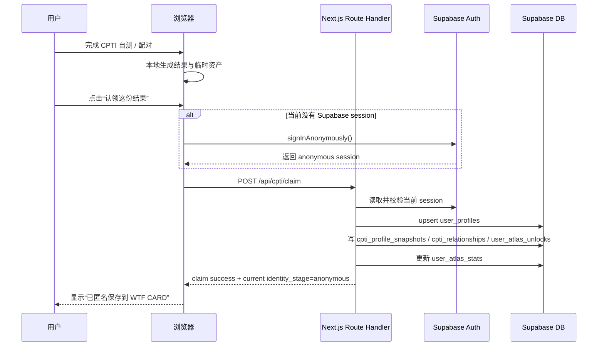
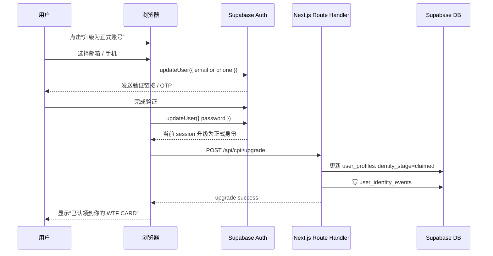
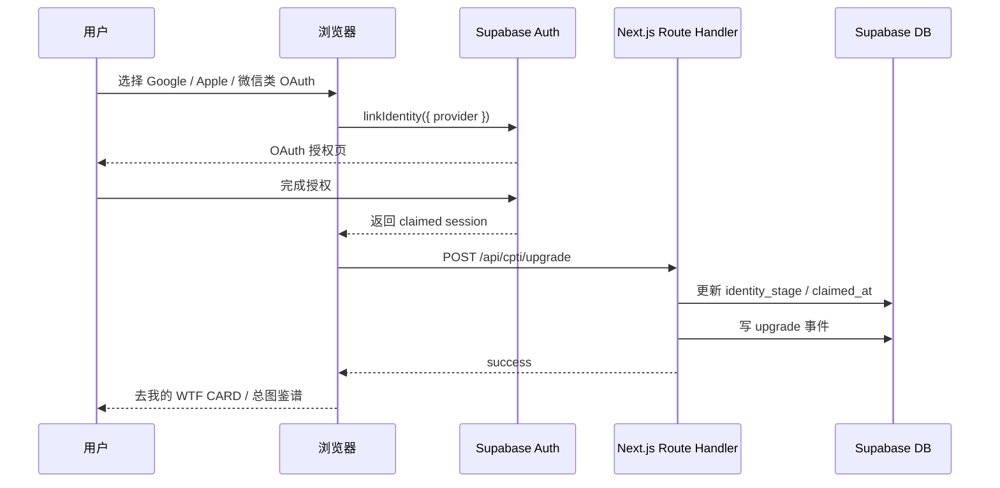
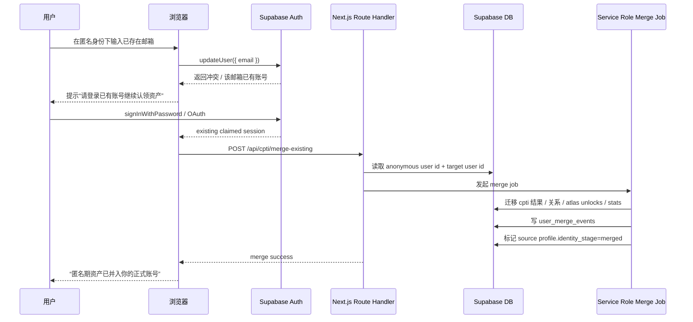

# CPTI Supabase Auth 与匿名转正时序图

> Owner: Backend + Product
> Status: Active Spec
> Priority: P1
> Last Updated: 2026-04-16
> Review Cadence: Before auth-flow implementation changes
> Next Decision: Decide whether anonymous upgrade and existing-account merge ship together or in separate phases

> 日期：2026-04-15
> 适用范围：`CPTI` 结果页、关系页、`WTF CARD` 资产认领、匿名身份升级为正式账号
> 对应 SQL：`docs/02-modules/cpti/cpti-supabase-schema-v1.sql`

---

## 1. 目标

这套设计要解决 4 个问题：

1. 用户可以先玩，不被登录打断
2. 用户在高价值节点可以“认领资产”
3. 资产先挂到匿名身份，后续可升级为正式账号
4. 如果用户绑定的是已有账号，可以把匿名期资产安全迁过去

核心原则：

> 先给结果，再要身份；先保住资产，再引导升级。

---

## 2. 官方约束与实施原则

基于 Supabase 官方资料，这一套落地时要遵守下面几条：

### 2.1 匿名用户不是 `anon key`

`signInAnonymously()` 创建的是一个真实 Auth 用户。

官方说明：

- 匿名用户和正式用户一样走 `authenticated` role
- JWT 上带 `is_anonymous` claim
- 这和单纯用 `anon` / publishable key 访问公开数据不是一回事

因此匿名用户已经可以承载用户私有资产，只是还没完成“认领”。

来源：

- [Anonymous Sign-Ins](https://supabase.com/docs/guides/auth/auth-anonymous)

### 2.2 Next.js SSR 必须走 cookies

Supabase 官方对 Next.js 的 SSR 推荐是：

- 使用 `@supabase/ssr`
- 浏览器 client 和服务器 client 分开
- session 放 cookies，不再依赖 localStorage 作为主会话来源

来源：

- [Creating a Supabase client for SSR](https://supabase.com/docs/guides/auth/server-side/creating-a-client?queryGroups=framework&framework=nextjs)
- [Advanced guide](https://supabase.com/docs/guides/auth/server-side/advanced-guide)

### 2.3 认证相关页面不要静态缓存

官方明确提醒：

- 认证相关路由不要 ISR
- 会写 `Set-Cookie` 的响应要避免 CDN/Edge 错误缓存
- 在 Next.js 上应使用动态渲染，并给认证响应设置 `Cache-Control: private, no-store`

来源：

- [Advanced guide](https://supabase.com/docs/guides/auth/server-side/advanced-guide)

### 2.4 RLS 与 service role 分工要明确

官方明确说明：

- 浏览器可读写的表必须启用 RLS
- `service role` / secret key 只能放在可信后端
- 它会绕过 RLS，不能暴露到前端

来源：

- [Securing your data](https://supabase.com/docs/guides/database/secure-data)
- [Row Level Security](https://supabase.com/docs/guides/database/postgres/row-level-security)

---

## 3. 推荐身份状态机

这套产品不要只有“已登录/未登录”两态，而应该有三态：

### State A：Local Guest

特征：

- 还没有 Supabase session
- 结果在 `localStorage` / `sessionStorage`
- 可分享、可配对、可继续浏览

适合阶段：

- 刚完成测试
- 刚看到结果
- 还没点击“认领资产”

### State B：Anonymous Asset User

特征：

- 已有 Supabase anonymous session
- 结果、图鉴、关系已同步到云端
- 还未绑定邮箱/手机/OAuth

这是最关键的中间态。

它的价值是：

- 不打断主流程
- 先把资产保住
- 后面再把“登录注册”变成升级动作

### State C：Claimed User

特征：

- 已完成邮箱/手机/OAuth 绑定
- 同一身份继续持有所有资产
- 后续以正式账号参与图鉴、榜单、资料页

### 补充状态：Merged User

这个状态只在“匿名用户绑定到一个已存在正式账号”时出现。

此时匿名用户的资产会迁移到目标账号：

- 源用户 `identity_stage = merged`
- 目标账号继续作为最终身份

---

## 4. 推荐前后端职责分工

## 4.1 浏览器负责

- 展示 `CPTI` 结果
- 保存本地临时结果
- 在用户点击“认领资产”时触发匿名登录
- 在用户点击“升级账号”时发起邮箱/OAuth 流程

## 4.2 Route Handlers / Server Actions 负责

- 验证当前 session
- 幂等写入结果与关系资产
- 处理“匿名资产 -> 正式账号”的升级落库
- 处理已有账号冲突时的数据迁移与合并
- 用 service role 执行管理员级的迁移逻辑

## 4.3 Supabase 负责

- `auth.users`
- session / cookies
- RLS 控制
- Postgres 真相源

---

## 5. 推荐文件边界

建议后续实现时新增这几类文件：

- `src/lib/supabase/client.ts`
- `src/lib/supabase/server.ts`
- `src/lib/supabase/admin.ts`
- `src/lib/supabase/proxy.ts`
- `src/app/auth/callback/route.ts`
- `src/app/api/cpti/claim/route.ts`
- `src/app/api/cpti/upgrade/route.ts`
- `src/app/api/cpti/merge-existing/route.ts`

职责建议：

- `client.ts`
  浏览器侧 Supabase client
- `server.ts`
  Route Handler / Server Component 内按请求创建 client
- `admin.ts`
  只在服务端用 secret key 执行 merge / backfill / 风控
- `proxy.ts`
  管理 cookie 刷新与会话续期

---

## 6. 时序图 A：结果页点击“认领资产”

这个动作是整个链路最重要的一步。

### 触发时机

- 用户已经看到 `CPTI` 结果
- 用户已经接受“这是我的结果”
- 用户愿意为了“保存”多做一步



### 为什么先匿名登录再写云端

因为这样所有后续资产都能直接挂到同一个 `auth.users.id` 上，不需要后面再做一次“local guest -> server guest”的额外迁移。

---

## 7. 时序图 B：匿名身份升级为新正式账号

适用场景：

- 用户点击“继续认领账号”
- 用户选择邮箱 / 手机 / OAuth
- 这是一个新的正式身份，不存在冲突

### 邮箱 / 手机路线



### OAuth 路线



---

## 8. 时序图 C：绑定到已有正式账号时的冲突合并

这是最容易被忽略，但必须在方案里提前想好的部分。

Supabase 官方对匿名用户升级时明确提到：

- 如果要绑定的邮箱已经属于一个现有账号
- 就不能把这件事简单当成“升级成功”
- 必须把它当成数据冲突处理

因此产品和后端都要有 merge 策略。

### 推荐策略

默认使用：

- 关系记录：合并去重
- 图鉴解锁：并集
- 最新昵称/头像：以目标正式账号为准
- 时态模块：保留最近记录



### 合并时服务端必须做的事

- 使用 service role 执行
- 幂等
- 有审计表
- 能回滚或至少能追溯

因此 `public.user_merge_events` 必须保留。

---

## 9. 推荐接口草案

## 9.1 `POST /api/cpti/claim`

### 目的

把当前本地结果同步到当前 Supabase 身份下。

### 输入

```json
{
  "draftId": "cpti-local-uuid",
  "source": "result_page",
  "cptiProfile": {
    "personalitySlug": "xxxx",
    "dimensionScores": []
  },
  "relationshipDraft": null,
  "atlasDrafts": []
}
```

### 输出

```json
{
  "ok": true,
  "identityStage": "anonymous",
  "claimedAssets": {
    "profileSaved": true,
    "relationshipSaved": false,
    "unlockCount": 1
  }
}
```

## 9.2 `POST /api/cpti/upgrade`

### 目的

在 Auth 层升级完成后，补齐业务层状态变更。

### 处理内容

- 更新 `user_profiles`
- 写 `user_identity_events`
- 返回新的 CTA 状态

## 9.3 `POST /api/cpti/merge-existing`

### 目的

把匿名期资产合并到已存在账号。

### 处理内容

- 校验目标账号
- 发起 merge job
- 合并/去重/更新聚合
- 写审计事件

---

## 10. RLS 与 service role 的边界

## 10.1 publishable key + 用户 session

适合：

- 读自己的资料
- 读自己的图鉴
- 读自己的结果
- 读 public registry

## 10.2 service role / secret key

只用于：

- merge existing account
- 管理员后台
- 榜单回补
- 风控修正
- 批量 backfill

绝对不要：

- 放到前端
- 放到日志
- 放到 URL
- 让客户端直接持有

## 10.3 匿名登录的风控与清理

Supabase 官方对匿名登录还有两个很实际的提醒：

- 匿名用户会真实写进 `auth.users`
- 如果不做防刷，坏流量会直接放大你的用户表体积

因此这套链路上线时，建议同时做：

- 对 `signInAnonymously()` 入口加 CAPTCHA / Turnstile
- 对结果页“认领资产”按钮加基础 rate limit
- 对长期未认领、长期无资产的匿名用户做定期清理

这部分并不是“以后再说”的优化，而是匿名登录上线时就应该一起上的配套。

---

## 11. Next.js / Vercel 落地注意事项

## 11.1 认证相关路由动态渲染

建议：

- 认证页 `dynamic = 'force-dynamic'`
- Auth callback route `Cache-Control: private, no-store`

## 11.2 不要在模块级单例里缓存 Supabase client

Supabase 官方在 SSR advanced guide 里专门提醒了 Vercel warm instance / Fluid compute 场景：

- 不要把带用户状态的 Supabase client 存在模块级变量里
- 每个请求里重新创建 client

## 11.3 登录后先落一个非预取过渡页

官方 advanced guide 对 Next.js 的建议是：

- 登录完成后，先到一个不带大量 prefetch 的中转页
- 等 cookies/session 稳定后，再跳到真正目的页

这对你们后面做：

- `/auth/callback`
- `/auth/claimed`

这类页面很有帮助。

## 11.4 Preview 环境不要默认当成“完整 staging”

对于 `Vercel + Supabase`，要明确这两件事：

- Vercel Preview Deployment 和 Supabase Preview Branch 不是同一个东西
- Supabase preview branch 默认是 `data-less`

所以第一阶段更稳的方式依然是：

- `production`
- `persistent staging`
- 本地 migrations + seed

而不是指望每个 Preview 都自动拥有可用的认证和测试数据。

---

## 12. 推荐实现顺序

### Step 1

把 `Supabase` 会话接起来，但不改主流程。

### Step 2

只在 `CPTI` 结果页 / 关系页新增“认领资产”按钮。

### Step 3

点击后静默 anonymous sign-in，再调用 `/api/cpti/claim`。

### Step 4

当用户看到“已保存到 WTF CARD”后，再引导邮箱/OAuth 升级。

### Step 5

最后再补已有账号冲突合并。

---

## 13. 一句话决策

技术上的核心不是“先把用户登录做出来”，而是：

> 先让资产有身份，再让身份变正式。

这正是 `Supabase anonymous -> claimed` 这条链路最适合承接的事情。
